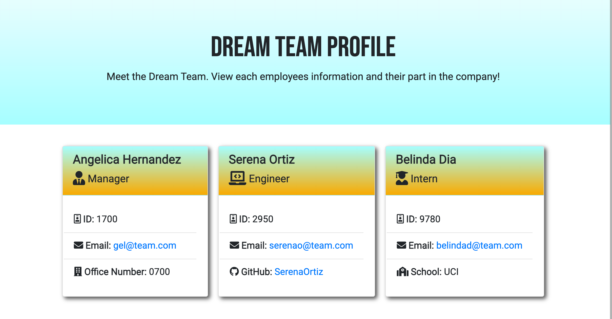
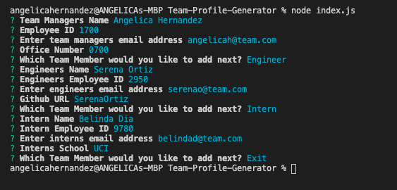
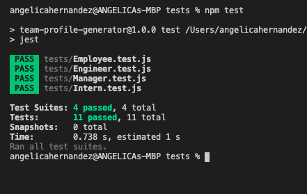

# Team-Profile-Generator

## License: 

## Table of Contents

- [Description](#description)
- [Installation](#installation)
- [Usage](#usage)
- [Contribution](#contribution)
- [Test](#test)
- [License](#license)
- [Contact](#questions)

## Description

🎥 [Walkthrough Video](https://drive.google.com/file/d/1uXkS0te4fHCOxFoZfms_QxHPrUuKBN6K/view?usp=sharing)

[Deployed App Results](https://angelicalorraine.github.io/Team-Profile-Generator/)

Build a Node.js command-line application that takes in information about employees on a software engineering team, then generates an HTML webpage that displays summaries for each person. Also write a unit test for every part of your code and ensure that it passes each test.

## Installaion

In order to create this complete application, you’ll first need to copy or clone this repository to your folder. Once complete you’ll need to install npm, Node.js and the Inquirer.js package.

## Usage

This command-line application takes in different employee information to build a Team Profile with each employees position, details and necessary descriptions.

## Contributing

As this is a public repository anyone can contribute by submitting advice, additions, bugs or a friendly update!

## Test

🎥 [Tests Video](https://drive.google.com/file/d/1o5gDrVF3Pl3TsjBimkuuE1poD_SEIO-d/view?usp=sharing)

A test was created for each different type of employee, to ensure inputs were being received correctly. Employee being the main class created with Manager, Engineer and Intern extending the Employee class and adding necessary properties per employee type. .to make sure all information is being passed through correctly.

## License

Licensed under [MIT License](https://spdx.org/licenses/MIT.html).

## Questions

- Let's connect on Linkedin at [Angelica Hernandez](https://www.linkedin.com/in/angelica-hernandez-/)
- Follow me on Github at [angelicalorraine](http://github.com/angelicalorraine)
- For more questions contact me: gel.lorraine@gmail.com
